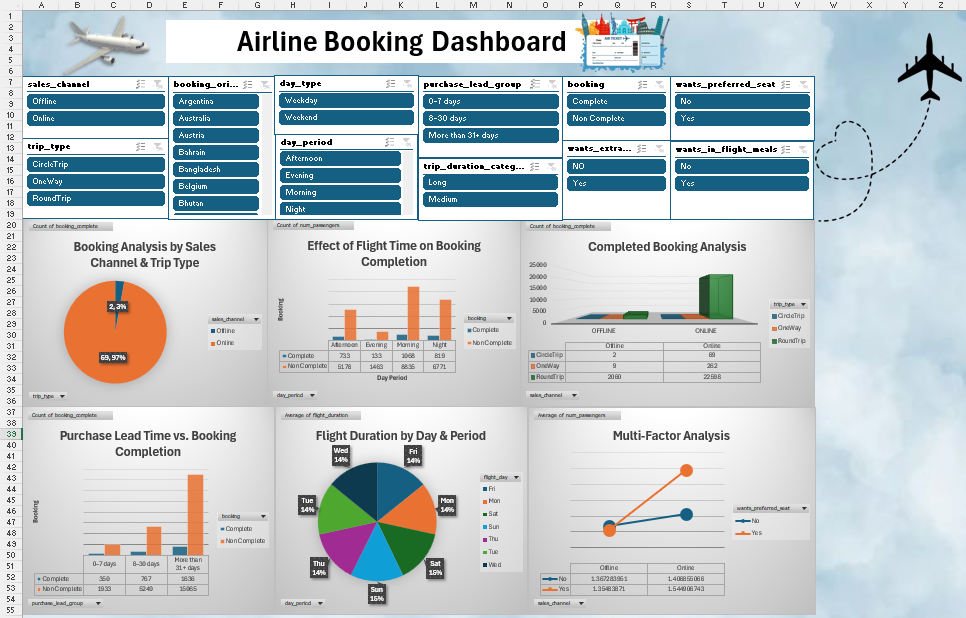

# ✈️ Airline Booking Analysis

## 📌 Overview

This project analyzes airline booking data using Excel, Python, and SQL Server to understand customer behavior, booking trends, and airline operational performance.

The project follows a complete analytics workflow from data cleaning and transformation to visualization and business insights.

---

## 🎯 Objectives

- Analyze airline booking trends.
- Understand customer preferences.
- Evaluate booking channels.
- Analyze flight timing and trip duration.
- Build interactive dashboards.
- Generate business insights for decision-making.

---

## 🛠️ Technologies


---

## 📂 Project Workflow

### 1️⃣ Data Collection

- Airline booking dataset (25,000 records)

### 2️⃣ Data Cleaning

- Removed missing values
- Standardized categories
- Validated data types
- Checked duplicates

### 3️⃣ Data Transformation

Created new analytical features:

- Trip Duration Category
- Day Type
- Day Period
- Purchase Lead Group
- Booking Status

### 4️⃣ Analysis

- Excel Pivot Tables
- SQL Queries
- Python EDA
- Data Visualization

### 5️⃣ Business Insights

Generated insights about:

- Booking channels
- Customer preferences
- Geographic distribution
- Flight performance
- Booking behavior

---

## 📊 Dashboard Preview



---

## 📈 Key Insights

- Online bookings represented over 90% of all reservations.
- Most customers requested extra baggage.
- Australia generated the highest number of bookings.
- Medium-duration flights were the most common.
- Average passengers per booking ranged between 1 and 2.

---

## 📂 Project Structure

```text
Airline-Booking-Analysis
│
├── data/
├── notebooks/
├── sql/
├── excel/
├── report/
├── presentation/
└── images/
```

---

## 👩‍💻 Author

**Yara El-Shamly**

Artificial Intelligence Graduate

- 💼 LinkedIn: https://www.linkedin.com/in/yara-elshamly-6427ba283
- 🐙 GitHub: https://github.com/YARA-ELSHAMLY
